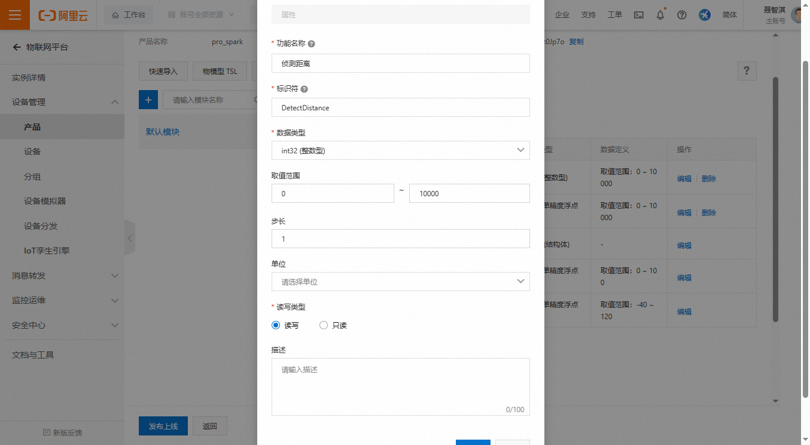
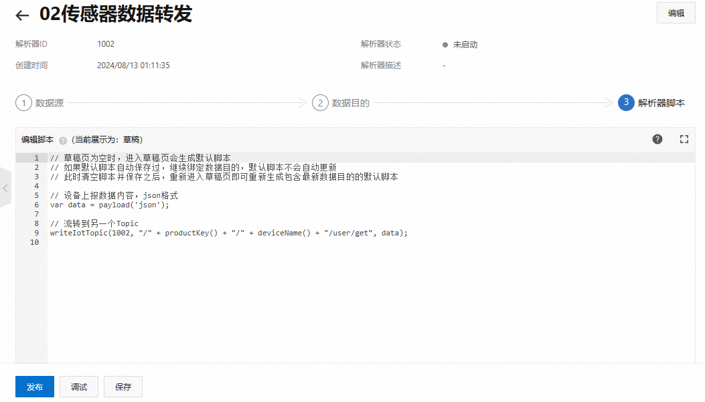

# RTT-SmartSensor-IoT

[English](README_es.md)


[toc]


## **一、项目描述：**

基于星火一号开发板的小型物联网项目，旨在实现环境监测和远程控制功能。该项目集成了多种传感器、云连接、用户界面和远程控制功能，提供了一个实用的平台来监测环境。


### 1.1 **特点：**

1. **环境数据采集：**
   - 使用板载 AHT10 传感器进行温度和湿度测量。
   - 利用 AP3216C 传感器进行接近检测和环境光照强度测量。
2. **云连接：**
   - 采用 MQTT 协议连接到阿里云，上传传感器数据并订阅控制命令。
   - 提供实时数据传输和命令处理功能，实现对板载外围设备（如 LED 矩阵、单个 LED 和蜂鸣器）的远程控制。
3. **小程序远程控制：**
   - 开发定制的移动端小程序程序以实时监控传感器数据并发送控制命令。
   - 允许用户远程更改 LED 矩阵的颜色模式、切换 LED 状态和切换蜂鸣器状态。

此项目虽然简单，但展示了结合硬件、软件和云服务的物联网监测和控制系统的基本概念，提供了一种实用且易于理解的环境监测和管理方案。


### 1.2 **当前进度：**

1、实现了对基本外围硬件的测试（传感器、wifi、led灯等）

2、实现了对阿里云平台的设备注册与连接测试，完成基本数据上传与消息控制命令解析的测试

3、完成各个任务之间的通信与基本实现

4、完成微信小程序开发，可自动获取手机位置显示气象数据，并可以通过设置连接阿里云设备参数连接至阿里云物联网，并可以同步发送与解析传感器数据

5、阿里云消息流转与数据解析实现

6、实现了几个led矩阵的函数并放置于一个函数指针数组中用于切换显示模式

7、基本完成开发说明撰写

   

## 二、开发前准备

### 2.1 RT-Thread开发环境搭建

1. 安装git [Git - Downloads (git-scm.com)](https://git-scm.com/downloads)
2. 下载好ENV配置工具 [rt-thread.org/download.html#download-rt-thread-env-tool](https://www.rt-thread.org/download.html#download-rt-thread-env-tool)
3. 安装配置vscode，并安装插件`Cortex-Debug`、`C\C++`
4. 安装OpenOCD-20231002-0.12.0
5. 安装MobaXterm，用于串口连接与调试等功能

可以参考一下[RT-Thread-【12月】RT-Thread学习笔记 --（1）RT-Thread开发环境搭建RT-Thread问答社区 - RT-Thread](https://club.rt-thread.org/ask/article/69e92e00a6469940.html)

Env 是RT-Thread推出的开发辅助工具，针对基于RT-Thread操作系统的项目工程，提供编译构建环境、图形化系统配置及软件包管理功能。其内置的 menuconfig 提供了简单易用的配置剪裁工具，可对内核、组件和软件包进行自由裁剪，使系统以搭积木的方式进行构建。

配置vscode的`settings.json`文件

```
{
    "version": "0.2.0",
    "configurations": [
    {
    "name": "rt-spark-openocd",
    "executable": "${workspaceRoot}/rt-thread.elf",
    "request": "launch",
    "type": "cortex-debug",
    "runToEntryPoint": "main",
    "targetId": "STM32F407ZG",
    "servertype": "openocd",
    "configFiles": [
    "interface/stlink-v2.cfg",
    "target/stm32f4x.cfg"
    ],
    "armToolchainPath": "G:/ProgramFile/env-windows-v2.0.0/env-windows/tools/gnu_gcc/arm_gcc/mingw/bin", // ！！！需要修改为自己的GCC 工具链路径 ！！！
    "gdbPath": "G:/ProgramFile/env-windows-v2.0.0/env-windows/tools/gnu_gcc/arm_gcc/mingw/bin/arm-none-eabi-gdb.exe" // ！！！需要修改为自己的GDB 路径 ！！！
    }
    ]
    }
```


### 2.2 微信小程序开发环境搭建

具体的实现可以参考如下视频

[（小程序端）开发环境搭建和工具安装_哔哩哔哩_bilibili](https://www.bilibili.com/video/BV128411S7BB/?spm_id_from=333.788&vd_source=f825716d48b302d754912681f1ca6d94)

**微信开发者工具下载**

[developers.weixin.qq.com/miniprogram/dev/devtools/download.html](https://developers.weixin.qq.com/miniprogram/dev/devtools/download.html)

**安装node.js**


### 2.3 下载RT-Thread软件包

**下载RT-Thread相关源码**

```
git clone https://gitee.com/rtthread/rt-thread.git
```

RT-Thread源代码：`rt-thread\bsp\stm32\stm32f407-rt-spark\`，在该工程下右键点击`ConEmu Here`打开ENV环境，开始输入以下代码初始化

```
menuconfig
scons --target=vsc
>然后可以将配置好的.vscode下c_cpp_properties.json、launch.json文件复制到当前生成的.vscode目录下
scons -j12
>就可以测试是否可以正常编译
scons --dist
>将文件、库等全部打包到了当前目录下的dist目录下
```

通过`scons --dist`命令在`rt-thread\bsp\stm32\stm32f407-rt-spark`目录下打包的完整独立原始工程，该目录下就会多出一个`dist\project`文件夹，里面就是打包好的工程初始代码。

使用一个BSP包进行开发，一般会经过以下步骤：

1、使用menuconfig命令，对RT-Thread的内核和组件进行配置。

2、配置完成后，根据自己的编译器情况，使用scons --target=xxx生成对应的工程。（xxx为vsc、mdk5、iar）

3、打开对应的工程，即可进行代码编写开发。

4、可以使用scons --dist命令，移除不相关的芯片，把工程单独抽离出来。

**sdk-bsp-stm32f407-spark**

```
git clone https://gitee.com/RT-Thread-Studio-Mirror/sdk-bsp-stm32f407-spark.git
```

这是星火一号开发板的BSP与示例，有相关外设的一些操作示例

### 2.4 阅读RT-Thread文档

[RT-Thread 文档中心](https://www.rt-thread.org/document/site/#/)

[Env 用户手册 (rt-thread.org)](https://www.rt-thread.org/document/site/#/development-tools/env/env)


## 三、阿里云服务器设置

### 3.1 阿里云平台注册

[物联网平台 (aliyun.com)](https://iot.console.aliyun.com/lk/summary/new)

这个应该大家都没有问题，主要填一下信息验证一下就好了


登录后点击右上角控制台，再点击左上角选择物联网平台即可进入


### 3.2 添加产品与设备


进入试用的公共实例进行设备管理

**添加产品**


由于我们的监测器有温湿度的功能为了方便，我们直接选择温湿度检测的品类


然后添加一个post的topic，并同时将get的权限设置为发布和订阅


在功能定义下可以看到我们当前产品的默认物模型数据由于我们的监测器还有光照与接近传感器数据采集，在这我们再添加两个属性用于物模型数据显示


点击编辑草稿，添加自定义功能





**添加设备**


选择我们刚刚注册好的产品


点击查看设备，在物模型数据中即可看到我们所定义的新属性


### 3.3 云产品消息流转

由于阿里云物联网平台的限制，不同设备之间不能互相订阅彼此的Topic，所以两个设备之间的信息流动就需要使用的消息流转功能，他能够把一个设备的某一个topic转发到另一个设备上或者进一步对数据进行操作。


我们需要创建两个解析器

一个用来将微信小程序控制数据转发到板卡订阅的topic上

另一个用来将板端消息发送的传感器数据转发到微信小程序订阅的topic上

#### 板端消息解析器


解析器的建立分为三步

**1数据源**


选择关联该数据源


点击添加topic


**2数据目的**


**3解析器脚本**



```
// 设备上报数据内容，json格式
var data = payload('json');

// 流转到另一个Topic
// writeIotTopic(1002, "/" + productKey() + "/" + deviceName() + "/user/get", data);
writeIotTopic(1000, "/hrnzsz0Jp7o/wx_app/user/get", data); //注意需要将冒号内的topic换成你自己的用于接收转发消息的topic就好
```

这里的关键就是把`writeIotTopic`函数中的Topic写好就ok了

#### 微信小程序控制数据解析器

基本流程是一样的，只是数据源换成了微信小程序所对应设备的topic，转发到的topic换成了板卡设备


## 四、星火一号任务撰写

### 4.1 RW007 WIFI 连接（SPI设备）

#### 打开板载的RW007外设驱动


我们还需要进入这个选项进一步修改硬件引脚配置。

```
(90) RW007 CS pin index
(29) RW007 BOOT0 pin index (same as spi clk pin)
(90) RW007 BOOT1 pin index (same as spi cs pin)
(107) RW007 INT/BUSY pin index
(111) RW007 RESET pin index
```

配置完后就在env环境中使用如下命令更新软件包

```
pkgs --update
[Use Gitee server - manually decision]
100%|███████████████████████████████████████████████████| 16/16 [00:01<00:00, 11.59it/s] ==============================>  RW007 v2.1.0 is downloaded successfully.

Operation completed successfully.
```

编译完成烧录后就可以使用如下命令对wifi进行操作了。

```
msh />wifi
wifi
wifi help
wifi scan [SSID]
wifi join [SSID] [PASSWORD]
wifi ap SSID [PASSWORD]
wifi disc
wifi ap_stop
wifi status
wifi smartconfig
```

可以使用如下命令来连接wifi

```
msh />wifi join 43324 433433433
[I/WLAN.mgnt] wifi connect success ssid:43324
msh />[I/WLAN.lwip] Got IP address : 192.168.1.102
```

####  任务代码编写

该段代码主要用于管理 Wi-Fi 连接，确保设备能够成功连接到指定的 Wi-Fi 网络，并在获取 IP 地址后，通过信号量通知其他任务启动，譬如后续的 MQTT 连接等。这是系统联网的关键步骤之一，为系统的联网通信功能提供了基础。通过线程和信号量的机制，使得Wi-Fi连接的过程是非阻塞的，可以与其他任务并行执行。

```c
#include "app_head.h"

#define WIFI_SSID "43324"   //wiif名字，需要根据实际情况修改（2.4G）
#define WIFI_PASSWORD "433433433"   //wifi密码，需要根据实际情况修改

#define THREAD_PRIORITY         16
#define THREAD_STACK_SIZE       1024
#define THREAD_TIMESLICE        5


// 新建信号量，用于wifi连接成功后的回调启动mqtt连接
rt_sem_t wifi_connect_sem = RT_NULL;

// 函数声明
rt_err_t rt_wlan_connect(const char *ssid, const char *password);

/* 定义一个线程控制块 */
static rt_thread_t thread_wifi = RT_NULL;
/* 定义一个线程入口 */
static void thread_wifi_entry(void *parameter)
{
    rt_kprintf("entry wifi thread\n");
    // 尝试连接wifi，连接成功后释放信号量删除线程，若连接不成功则间隔5s一直尝试
    while (1)
    {
        rt_kprintf("wifi thread connecting \n");

        rt_err_t result;
        result = rt_wlan_connect(WIFI_SSID, WIFI_PASSWORD);

        if (result != RT_EOK)
        {
            rt_kprintf("wifi connect failed\n");
            rt_thread_mdelay(1000);
        }
        else
        {
            rt_kprintf("wifi connected, checking IP...\n");
            // 检查是否获取到IP地址
            while (rt_wlan_is_ready() != RT_EOK)
            {
                rt_kprintf("waiting for IP address...\n");
                rt_thread_mdelay(1000);
            }

            rt_kprintf("IP acquired, wifi connect success\n");
            rt_sem_release(wifi_connect_sem);
            rt_thread_delete(thread_wifi);
        } 
    }
}


```

`thread_wifi_entry` 是 Wi-Fi 连接线程的入口函数，负责处理 Wi-Fi 连接的过程。

在线程启动后，循环尝试连接 Wi-Fi。如果连接失败，线程等待 1 秒后重新尝试；如果连接成功，则继续检查 IP 地址的获取。

`rt_wlan_is_ready` 函数用于检查 IP 地址是否成功获取，确保网络连接已经完全就绪。

一旦 Wi-Fi 连接和 IP 地址获取成功，线程释放信号量 `wifi_connect_sem`，通知其他任务可以继续执行。随后，删除该线程以释放资源。

```c
void app1_wifi_connect(void)
{
    // 提示信息：wifi线程开始创建
    rt_kprintf("creating wifi thread\n");
    // 初始化信号量
    wifi_connect_sem = rt_sem_create("wifi_sem", 0, RT_IPC_FLAG_FIFO);
    if (wifi_connect_sem == RT_NULL)
    {
        rt_kprintf("create wifi_connect_sem failed\n");
        return;
    }
    // 初始化wifi线程
    thread_wifi = rt_thread_create("wifi_thread", thread_wifi_entry, RT_NULL, THREAD_STACK_SIZE, THREAD_PRIORITY, THREAD_TIMESLICE);
        /* 如果获得线程控制块，启动这个线程 */
    if (thread_wifi != RT_NULL)
    {
        rt_thread_startup(thread_wifi);
        rt_kprintf("create wifi thread sucess\n");
    }
    else
    {
        rt_kprintf("create thread_wifi failed\n");
    }    
}

MSH_CMD_EXPORT(app1_wifi_connect, wifi connect);
```

`app1_wifi_connect` 是应用程序的 Wi-Fi 连接启动函数。

在函数中首先创建 Wi-Fi 连接的信号量 `wifi_connect_sem`，并检查其创建是否成功。

随后，创建一个名为 `wifi_thread` 的线程，该线程执行 Wi-Fi 连接的具体逻辑。

如果线程创建成功，则启动线程，并输出成功信息；否则，输出创建失败信息。

最后，通过 `MSH_CMD_EXPORT` 宏，将 `app1_wifi_connect` 函数导出为 MSH 命令，可以在终端中直接执行此命令来启动 Wi-Fi 连接过程。


### 4.2 温湿度传感器采集

#### 打开板载的AHT外设驱动

1. 打开板上外设AHT32开关
2. 因为Kconfig里面关联了，所以不用再次打开软件包开启IIC总线
3. 查看确认一下
4. 搜索rt_vsprintf_full软件包（支持浮点输出）
5. 使用`pkgs –update`，下载软件包

####  任务代码编写

下面这一部分代码主要用于管理 AHT10 传感器的读取，并通过消息队列的方式将湿度和温度数据传递给其他任务或模块。与 Wi-Fi 连接代码相比，该段代码更侧重于数据采集，确保设备能够实时获得环境温湿度数据，为后续的数据处理、上传（例如通过 MQTT 传输）提供支持。这些传感器数据是物联网系统中常见的监测内容，属于系统整体功能的重要组成部分。

```c
#include "app_head.h"
#include "aht10.h"

#define LOG_TAG              "app_aht21"
#define LOG_LVL              LOG_LVL_DBG
#include <ulog.h>

static float humidity, temperature;
static aht10_device_t dev;
static int count;
/* 总线名称 */
static const char *i2c_bus_name = "i2c3";

//新建一个线程专门用于读取传感器温湿度数据并将数据分别放入两个消息队列中
static rt_thread_t thread1 = RT_NULL;
rt_mq_t mq_hum = RT_NULL;
rt_mq_t mq_tem = RT_NULL;

// 新建信号量，用于线程创建成功后的回调启动mqtt连接
rt_sem_t aht32_connect_sem = RT_NULL;


/* 定义一个线程入口 */
static void thread_aht10_entry(void *parameter)
{
    // 释放信号量
    rt_sem_release(aht32_connect_sem);

    while (1)
    {
        /* 读取湿度 */
        humidity = aht10_read_humidity(dev);
        // LOG_D("humidity   : %d.%d %%", (int)humidity, (int)(humidity * 10) % 10);
        rt_mq_urgent(mq_hum, &humidity, sizeof(humidity));

        /* 读取温度 */
        temperature = aht10_read_temperature(dev);
        // LOG_D("temperature: %d.%d", (int)temperature, (int)(temperature * 10) % 10);
        rt_mq_urgent(mq_tem, &temperature, sizeof(temperature));
        rt_thread_mdelay(200);
    }
}
```

`thread_aht10_entry` 是用于读取 AHT10 传感器数据的线程入口函数。

线程启动后，首先释放信号量 `aht32_connect_sem`，通知其他任务可以继续执行（例如，MQTT 连接）。

线程进入一个无限循环，每次循环中：

- 调用 `aht10_read_humidity(dev)` 读取湿度数据，并将其放入湿度消息队列 `mq_hum`。
- 调用 `aht10_read_temperature(dev)` 读取温度数据，并将其放入温度消息队列 `mq_tem`。
- 每次读取后线程休眠 200 毫秒，避免频繁读取数据导致系统负担过重。

```c
void app2_aht21_example(void)
{
    // 提示信息
    rt_kprintf("creating aht21 thread\n");
    // 初始化信号量
    aht32_connect_sem = rt_sem_create("aht32_sem", 0, RT_IPC_FLAG_FIFO);
    if (aht32_connect_sem == RT_NULL)
    {
        rt_kprintf("create aht32_connect_sem failed\n");
        return;
    }
    /* 初始化 aht10 */
    dev = aht10_init(i2c_bus_name);
    if (dev == RT_NULL)
    {
        LOG_E(" The sensor initializes failure");
        return;
    }
    // 初始化消息队列
    mq_hum = rt_mq_create("mq_hum", 10, sizeof(humidity), RT_IPC_FLAG_FIFO);
    mq_tem = rt_mq_create("mq_tem", 10, sizeof(temperature), RT_IPC_FLAG_FIFO);
    // 创建线程
    thread1 = rt_thread_create("thread_aht10", thread_aht10_entry, RT_NULL, 1024, 25, 10);
    if (thread1 != RT_NULL)
    {
        rt_thread_startup(thread1);
        rt_kprintf("creating aht21 rt_thread_startup\n");
    }
    else
    {
        LOG_E("thread1 create failed");
    }
}

/* 导出到 msh 命令列表中 */
MSH_CMD_EXPORT(app2_aht21_example, app_aht21_example);
```

`app2_aht21_example` 函数是 AHT21 应用的初始化函数，通过 MSH 命令执行。

函数执行时首先创建一个信号量 `aht32_connect_sem`，用于在线程创建成功后通知其他任务。

然后，初始化 AHT10 传感器设备 `dev`，使用指定的 I2C 总线 `i2c_bus_name` 进行通信。

如果传感器初始化失败，则输出错误日志并返回。

成功初始化传感器后，分别为湿度和温度创建消息队列 `mq_hum` 和 `mq_tem`，用于存储传感器读取的数据。

最后，创建并启动线程 `thread1`，该线程执行 `thread_aht10_entry` 函数中的逻辑，负责读取传感器数据并放入消息队列中。

### 4.3光照与接近传感器数据采集

#### AP3216C外设驱动使能

```
Hardware Drivers Config 
	→ Onboard Peripheral Drirs
		→ [*] Enable AP3216C(i2c2)
```

####  任务代码编写

这段代码实现了从AP3216C传感器读取光照强度和接近检测数据，并将这些数据放入两个不同的消息队列中，以便其他线程或任务可以使用这些数据。`mq_brightness` 和 `mq_distance` 分别是存储亮度和距离数据的消息队列。

```c
#include <rtthread.h>
#include <rtdevice.h>
#include <board.h>

#include <ap3216c.h>

#define LOG_TAG             "ap3216c"
#define LOG_LVL              LOG_LVL_DBG
#include <ulog.h>

static float brightness, distance;
static ap3216c_device_t dev;

//新建一个线程专门用于读取传感器数据并将数据分别放入两个消息队列中
static rt_thread_t thread1 = RT_NULL;
rt_mq_t mq_brightness = RT_NULL;
rt_mq_t mq_distance = RT_NULL;

// 新建信号量，用于线程创建成功后的回调启动mqtt连接
rt_sem_t ap3216_connect_sem = RT_NULL;

/* 定义一个线程入口 */
static void thread_ap3216_entry(void *parameter)
{
    // 释放信号量
    rt_sem_release(ap3216_connect_sem);
    while (1)
    {
        static int i =0;
        i++;
        rt_uint16_t ps_data;
        float brightness;
        ps_data = ap3216c_read_ps_data(dev);
        // LOG_D("current ps data: %d.", ps_data);
        rt_mq_urgent(mq_distance, &ps_data, sizeof(ps_data));

        brightness = ap3216c_read_ambient_light(dev);
        // LOG_D("current brightness: %d.%d(lux).", (int)brightness, ((int)(10 * brightness) % 10));
        rt_mq_urgent(mq_brightness, &brightness, sizeof(brightness));
        rt_thread_mdelay(200);
    }

}


```

`thread_ap3216_entry` 是用于读取 AP3216C 传感器数据的线程入口函数。

线程启动后首先释放信号量 `ap3216_connect_sem`，通知其他任务可以继续执行（如 MQTT 连接）。

线程进入一个无限循环，每次循环中：

- 调用 `ap3216c_read_ps_data(dev)` 读取距离数据（即红外接近传感器的数据），并将其放入消息队列 `mq_distance`。
- 调用 `ap3216c_read_ambient_light(dev)` 读取环境光亮度数据，并将其放入消息队列 `mq_brightness`。
- 每次读取后线程休眠 200 毫秒，以减少读取频率和系统负担。

```c
void app2_ap3216_example(void)
{
    // 初始化信号量
    ap3216_connect_sem = rt_sem_create("ap3216_sem", 0, RT_IPC_FLAG_FIFO);
    if (ap3216_connect_sem == RT_NULL)
    {
        rt_kprintf("create ap3216_connect_sem failed\n");
        return;
    }

    // 提示信息
    rt_kprintf("creating ap3216 thread\n");

    const char* i2c_bus_name = "i2c2";
    dev = ap3216c_init(i2c_bus_name);

    // 初始化消息队列
    mq_brightness = rt_mq_create("mq_bright", 10, sizeof(brightness), RT_IPC_FLAG_FIFO);
    mq_distance = rt_mq_create("mq_distance", 10, sizeof(distance), RT_IPC_FLAG_FIFO);

    // 创建线程
    thread1 = rt_thread_create("thread_ap3216", thread_ap3216_entry, RT_NULL, 1024, 25, 10);
    if (thread1 != RT_NULL)
    {
        rt_thread_startup(thread1);
        rt_kprintf("creating ap3216 rt_thread_startup\n");
    }
    else
    {
        LOG_E("app2_ap3216_example thread create failed");
    }
}

/* 导出到 msh 命令列表中 */
MSH_CMD_EXPORT(app2_ap3216_example, app2_ap3216_example);
```

`app2_ap3216_example` 函数是 AP3216C 应用的初始化函数，通过 MSH 命令执行。

首先创建一个信号量 `ap3216_connect_sem`，用于在线程创建成功后通知其他任务。

提示开始创建 AP3216C 传感器线程，并通过 `ap3216c_init(i2c_bus_name)` 初始化传感器设备 `dev`。

成功初始化传感器后，分别为亮度和距离数据创建消息队列 `mq_brightness` 和 `mq_distance`，用于存储传感器读取的数据。

最后，创建并启动线程 `thread1`，该线程执行 `thread_ap3216_entry` 函数中的逻辑，负责读取传感器数据并放入消息队列中。

### 4.4 MQTT数据发送与解析

#### Ali-iotkit使能

在软件包中找到阿里云的软件包，使能后需要修改里面的一些参数，主要是如下列出的四个，需要与阿里云中我们创建的设备和产品参数一致。

```
RT-Thread online packages  --->
	->IoT - internet of things  --->
		IoT Cloud  --->
			[*] Ali-iotkit: Aliyun cloud sdk 'iotkit-embedded' for RT-Thread  --->
				(a1dSQSGZ77X) Config Product Key (NEW)
				(NfIdVcfBP7rtH24H) Config Product Secret (NEW)
				(RGB-LED-DEV-1) Config Device Name (NEW)
				(Ghuiyd9nmGowdZzjPqFtxhm3WUHEbIlI) Config Device Secret (NEW)
    			[*]sample
			
```

在阿里云中找到这些参数并修改进去


由于勾选了阿里云的例程，在命令行中连接好WiFi，再输入以下例程命令，不出意外的话就可以正常连接阿里云服务器了。

```
msh />mqtt_example
msh />mqtt_example_main|135 :: mqtt example
host name:hrnzsz0jp7o.iot-as-mqtt.cn-shanghai.aliyuncs.com

> {
>     "id": "0",
>     "version": "1.0",
>     "params": [
>         {
>             "attrKey": "SYS_LP_SDK_VERSION",
>             "attrValue": "3.0.1",
>             "domain": "SYSTEM"
>         },
>         {
>             "attrKey": "SYS_SDK_LANGUAGE",
>             "attrValue": "C",
>             "domain": "SYSTEM"
>         }
>     ],
>     "method": "thing.deviceinfo.update"
> }


> {
>     "id": "1",
>     "params": {
>         "version": "app-1.0.0-20180101.1000"
>     }
> }


> {
>     "message": "hello!"
> }

example_event_handle|108 :: msg->event_type : 9
example_event_handle|108 :: msg->event_type : 9
example_event_handle|108 :: msg->event_type : 3

< {
<     "message": "hello!"
< }
```

后面感觉由于发送和接收的消息一直在shell终端回显，于是追踪了回显打印的函数，发现是由`FEATURE_INFRA_NETWORK_PAYLOAD`这个宏控制的，在env环境下搜索即可找到并取消选中，

```
(Top) → RT-Thread online packages → IoT - internet of things → IoT Cloud → Ali-iotkit: Aliyun cloud sdk 'iotkit-embedded' for RT-Thread
[ ] FEATURE_INFRA_NETWORK_PAYLOAD
```

####  任务代码编写

下面的代码实现了MQTT客户端的功能，包括订阅云端消息、发布本地传感器数据至云端以及处理云端下发的控制指令。

```c
static void example_message_arrive(void *pcontext, void *pclient, iotx_mqtt_event_msg_pt msg)
{
    iotx_mqtt_topic_info_t     *topic_info = (iotx_mqtt_topic_info_pt) msg->msg;

    switch (msg->event_type) {
        case IOTX_MQTT_EVENT_PUBLISH_RECEIVED:
            /* print topic name and topic message */
            EXAMPLE_TRACE("Message Arrived:");
            EXAMPLE_TRACE("Topic  : %.*s", topic_info->topic_len, topic_info->ptopic);
            EXAMPLE_TRACE("Payload: %.*s", topic_info->payload_len, topic_info->payload);
            EXAMPLE_TRACE("\n");
            // 解析json数据
            cJSON *root = cJSON_Parse(topic_info->payload);
            if (root == NULL) {
                EXAMPLE_TRACE("json parse error");
                return;
            }
            cJSON *cmd = cJSON_GetObjectItem(root, "cmd");
            if (cmd == NULL) {
                EXAMPLE_TRACE("json parse error");
                cJSON_Delete(root);
                return;
            }
            // 打印解析后的数据
            EXAMPLE_TRACE("cmd: %s",cmd->valuestring);
            // 控制红色led
            if (strcmp(cmd->valuestring, "redledon") == 0) {
                rt_pin_write(GPIO_LED_R, PIN_LOW);
            } else if (strcmp(cmd->valuestring, "redledoff") == 0) {
                rt_pin_write(GPIO_LED_R, PIN_HIGH);
            }
            // 控制蓝色led
            else if (strcmp(cmd->valuestring, "blueledon") == 0) {
                rt_pin_write(GPIO_LED_B, PIN_LOW);
            } else if (strcmp(cmd->valuestring, "blueledoff") == 0) {
                rt_pin_write(GPIO_LED_B, PIN_HIGH);
            }
            // 控制beep
            else if (strcmp(cmd->valuestring, "beepon") == 0) {
                rt_pin_write(PIN_BEEP,PIN_HIGH);
            } else if (strcmp(cmd->valuestring, "beepoff") == 0) {
                rt_pin_write(PIN_BEEP,PIN_LOW);
            }
            // 控制led矩阵,修改led_matrix_status的值
             else if (strcmp(cmd->valuestring, "lednoff") == 0) {
                led_matrix_status=0;
            }else if (strcmp(cmd->valuestring, "ledn0") == 0) {
                led_matrix_status=1;
            } else if (strcmp(cmd->valuestring, "ledn1") == 0) {
                led_matrix_status=2;
            } else if (strcmp(cmd->valuestring, "ledn2") == 0) {
                led_matrix_status=3;
            } else if (strcmp(cmd->valuestring, "ledn3") == 0) {
                led_matrix_status=4;
            } else if (strcmp(cmd->valuestring, "ledn4") == 0) {
                led_matrix_status=5;
            } else if (strcmp(cmd->valuestring, "ledn5") == 0) {
                led_matrix_status=6;
            }else if (strcmp(cmd->valuestring, "ledn6") == 0) {
                led_matrix_status=7;
            }else if (strcmp(cmd->valuestring, "ledn7") == 0) {
                led_matrix_status=8;
            }else if (strcmp(cmd->valuestring, "ledn8") == 0) {
                led_matrix_status=9;
            }

            break;
        default:
            break;
    }
}
```

`example_message_arrive`: 云端消息到达时的回调函数。

- 解析云端下发的JSON格式的消息，并根据消息内容控制LED状态和LED矩阵显示模式。
- 使用CJSON库解析JSON字符串，并根据`cmd`字段的内容执行相应的操作。

```c
static int example_subscribe(void *handle)
{
    int res = 0;
    const char *fmt = "/%s/%s/user/get";
    char *topic = NULL;
    int topic_len = 0;

    topic_len = strlen(fmt) + strlen(DEMO_PRODUCT_KEY) + strlen(DEMO_DEVICE_NAME) + 1;
    topic = HAL_Malloc(topic_len);
    if (topic == NULL) {
        EXAMPLE_TRACE("memory not enough");
        return -1;
    }
    memset(topic, 0, topic_len);
    HAL_Snprintf(topic, topic_len, fmt, DEMO_PRODUCT_KEY, DEMO_DEVICE_NAME);

    res = IOT_MQTT_Subscribe(handle, topic, IOTX_MQTT_QOS0, example_message_arrive, NULL);
    if (res < 0) {
        EXAMPLE_TRACE("subscribe failed");
        HAL_Free(topic);
        return -1;
    }

    HAL_Free(topic);
    return 0;
}
```

订阅云端主题的函数。

- 根据设备的产品密钥和设备名称构建主题。
- 使用`IOT_MQTT_Subscribe`函数订阅主题，并指定回调函数`example_message_arrive`。

```c
static void mqtt_tranfer_sensor(void *pclient)
{
    float humidity;
    float temperature;
    float brightness;
    rt_uint16_t distance;
    char *payload = NULL;
    int payload_len = 0,res = 0;

    const char     *fmt = "/sys/%s/%s/thing/event/property/post";
    char           *topic = NULL;
    int topic_len = 0;

    topic_len = strlen(fmt) + strlen(DEMO_PRODUCT_KEY) + strlen(DEMO_DEVICE_NAME) + 1;
    topic = HAL_Malloc(topic_len);
    if (topic == NULL) {
        EXAMPLE_TRACE("memory not enough");
        return;
    }
    memset(topic, 0, topic_len);
    HAL_Snprintf(topic, topic_len, fmt, DEMO_PRODUCT_KEY, DEMO_DEVICE_NAME);

    rt_mq_recv(mq_hum, &humidity, sizeof(humidity), RT_WAITING_NO);
    // LOG_D("humidity   : %d.%d %%", (int)humidity, (int)(humidity * 10) % 10);
    /* 从队列中读取温度并打印 */
    rt_mq_recv(mq_tem, &temperature, sizeof(temperature), RT_WAITING_NO);
    // LOG_D("temperature: %d.%d", (int)temperature, (int)(temperature * 10) % 10);

    rt_mq_recv(mq_brightness, &brightness, sizeof(brightness), RT_WAITING_NO);
    // LOG_D("brightness: %d.%d", (int)brightness, (int)(brightness * 10) % 10);

    rt_mq_recv(mq_distance, &distance, sizeof(distance), RT_WAITING_NO);
    // LOG_D("distance: %d.%d", (int)distance, (int)(distance * 10) % 10);

    // 判断数据是否合法
    if (humidity < 0 || humidity > 100 || temperature < -40 || temperature > 85) {
        EXAMPLE_TRACE("data error");
        return;
    }

    //计算payload所需长度，温度湿度数据保留一位小数上传，"params":{"CurrentTemperature":16.5,"CurrentHumidity":56.3,"LightValue":1000.0,"DetectDistance":1000.0}
    payload_len = strlen("{\"params\":{\"CurrentTemperature\":16.5,\"CurrentHumidity\":56.3,\"LightValue\":1000.0,\"DetectDistance\":1000}}") + 5;
    payload = HAL_Malloc(payload_len);
    if (payload == NULL) {
        EXAMPLE_TRACE("memory not enough");
        return;
    }
    memset(payload, 0, payload_len);
    HAL_Snprintf(payload, payload_len, "{\"params\":{\"CurrentTemperature\":%.1f,\"CurrentHumidity\":%.1f,\"LightValue\":%.1f,\"DetectDistance\":%d}}", temperature, humidity, brightness, (int)distance);
    
    res = IOT_MQTT_Publish_Simple(0, topic, IOTX_MQTT_QOS0, payload, strlen(payload));
    if (res < 0) {
        EXAMPLE_TRACE("publish failed, res = %d", res);
        HAL_Free(topic);
        HAL_Free(payload);
        return;
    }
    HAL_Free(topic);
    HAL_Free(payload);
}
```

`mqtt_tranfer_sensor`: 从消息队列读取传感器数据，并将其发布到云端的函数。

- 从消息队列中读取温湿度、光照强度和接近检测数据。
- 构建JSON格式的负载，并使用`IOT_MQTT_Publish_Simple`函数将数据发布到云端。

```c
static void mqtt_example_main(void *parameter)
{
    // 获取WiFi连接成功信号量，等待WiFi连接成功后再进行mqtt连接
    rt_sem_take(wifi_connect_sem, RT_WAITING_FOREVER);
    rt_sem_take(ap3216_connect_sem, RT_WAITING_FOREVER);
    rt_sem_take(aht32_connect_sem, RT_WAITING_FOREVER);

    void                   *pclient = NULL;
    int                     res = 0;
    int                     loop_cnt = 0;
    iotx_mqtt_param_t       mqtt_params;

    HAL_GetProductKey(DEMO_PRODUCT_KEY);
    HAL_GetDeviceName(DEMO_DEVICE_NAME);
    HAL_GetDeviceSecret(DEMO_DEVICE_SECRET);

    EXAMPLE_TRACE("mqtt example");
    /* Initialize MQTT parameter */
    memset(&mqtt_params, 0x0, sizeof(mqtt_params));
    mqtt_params.handle_event.h_fp = example_event_handle;
    pclient = IOT_MQTT_Construct(&mqtt_params);
    if (NULL == pclient) {
        EXAMPLE_TRACE("MQTT construct failed");
        return;
    }

    res = example_subscribe(pclient);
    if (res < 0) {
        IOT_MQTT_Destroy(&pclient);
        return;
    }

    while (1) {
        if (0 == loop_cnt % 10) {
            mqtt_tranfer_sensor(pclient);
        }

        IOT_MQTT_Yield(pclient, 200);

        loop_cnt += 1;
    }
    return;
}
// #ifdef FINSH_USING_MSH
// MSH_CMD_EXPORT_ALIAS(mqtt_example_main, ali_mqtt_sample, ali coap sample);
// #endif

static char mqtt_thread_stack[4096];
static struct rt_thread mqtt_thread;

void app3_mqtt_example(void)
{
    // 提示信息
    rt_kprintf("creating mqtt thread\n");

    rt_thread_init(&mqtt_thread, "mqtt_thread", mqtt_example_main, RT_NULL, mqtt_thread_stack, sizeof(mqtt_thread_stack), 20, 10);
    rt_thread_startup(&mqtt_thread);

    // 提示信息
    rt_kprintf("creating mqtt rt_thread_startup\n");

}

MSH_CMD_EXPORT(app3_mqtt_example, app_ali_mqtt_sample);
```

这一部分代码在整个个工程项目中负责MQTT客户端的功能，具体来说：

1. **云端通信**: 实现了与云端的双向通信功能，包括订阅云端下发的控制指令以及向云端发送传感器数据。
2. **消息处理**: 通过解析云端下发的JSON格式的消息，控制LED状态和LED矩阵显示模式。
3. **传感器数据上传**: 从消息队列中读取传感器数据，并将其转换为JSON格式，然后发布到云端。
4. **资源管理**: 通过创建和管理MQTT客户端线程来管理MQTT通信过程中的系统资源。

### 4.5  LED矩阵模式切换

#### LED矩阵外设使能

```
Hardware Drivers Config 
	→ Onboard Peripheral Drirs
		→[*] Enable Led MATRIX
```

####  任务代码编写

这部分实现了LED矩阵的各种显示效果，并通过一个线程周期性地更新LED矩阵的状态。

```c
#include "app_head.h"

#include <drv_matrix_led.h>
// 声明menset头文件
#include <stdio.h>
#include <string.h>

#define LED_NUM     19

volatile u_int8_t led_matrix_status;
static RGBColor_TypeDef RGB_Data[LED_NUM] = {0};

// 辅助函数：HSV 转 RGB（用于彩虹渐变显示）
RGBColor_TypeDef HSV_to_RGB(uint8_t hue) {
    uint8_t region = hue / 43;
    uint8_t remainder = (hue - (region * 43)) * 6;

    uint8_t p = 0;
    uint8_t q = (255 * (255 - remainder)) / 255;
    uint8_t t = (255 * remainder) / 255;

    switch (region) {
        case 0:
            return (RGBColor_TypeDef){255, t, p};
        case 1:
            return (RGBColor_TypeDef){q, 255, p};
        case 2:
            return (RGBColor_TypeDef){p, 255, t};
        case 3:
            return (RGBColor_TypeDef){p, q, 255};
        case 4:
            return (RGBColor_TypeDef){t, p, 255};
        default:
            return (RGBColor_TypeDef){255, p, q};
    }
}

// 定义 LED 矩阵控制模式函数:滚动显示效果
static void led_matrix_mode1(void) {
    static int offset = 0;
    RGBColor_TypeDef colors[] = {RED, GREEN, BLUE, WHITE};
    for (int i = 0; i < LED_NUM; i++) {
        Set_LEDColor(i, colors[(i + offset) % 4]);
    }
    offset = (offset + 1) % LED_NUM;
    RGB_Reflash();
}

static void led_matrix_mode2(void) {
    // 模式2的实现，例如：流水灯效果
    static int current_led = 0;
    RGBColor_TypeDef color = {255, 0, 0}; // 红色
    memset(RGB_Data, 0, sizeof(RGB_Data)); // 清空所有LED
    Set_LEDColor(current_led, color);
    current_led = (current_led + 1) % LED_NUM;
    RGB_Reflash();
}

static void led_matrix_mode3(void) {
    // 模式3的实现，例如：逐点点亮效果
    static int current_led = 0;
    RGBColor_TypeDef color = {0, 255, 0}; // 绿色
    if (current_led < LED_NUM) {
        Set_LEDColor(current_led, color);
        current_led++;
    } else {
        memset(RGB_Data, 0, sizeof(RGB_Data)); // 清空所有LED
        current_led = 0;
    }
    RGB_Reflash();
}

static void led_matrix_mode4(void) {
    // 模式4的实现，例如：红绿蓝循环显示
    static int color = 0;
    RGBColor_TypeDef colors[] = {RED, GREEN, BLUE};
    for (int i = 0; i < LED_NUM; i++) {
        Set_LEDColor(i, colors[color]);
    }
    color = (color + 1) % 3;
    RGB_Reflash();
}

static void led_matrix_mode5(void) {
    // 模式5的实现，例如：彩虹流动效果
    static int hue = 0;
    for (int i = 0; i < LED_NUM; i++) {
        Set_LEDColor(i, HSV_to_RGB((hue + i * 10) % 256));
    }
    hue = (hue + 1) % 256;
    RGB_Reflash();
}

static void led_matrix_mode6(void) {
    // 模式6的实现，例如：呼吸灯效果
    static uint8_t brightness = 0;
    static int8_t direction = 1;
    for (int i = 0; i < LED_NUM; i++) {
        RGBColor_TypeDef color = {brightness, brightness, brightness};
        Set_LEDColor(i, color);
    }
    brightness += direction * 5;
    if (brightness == 255 || brightness == 0) {
        direction = -direction;
    }
    RGB_Reflash();
}

static void led_matrix_mode7(void) {
    // 模式7的实现，例如：彩虹渐变显示
    static uint8_t hue = 0;
    for (int i = 0; i < LED_NUM; i++) {
        Set_LEDColor(i, HSV_to_RGB(hue + i * 10));
    }
    hue = (hue + 1) % 256;
    RGB_Reflash();
}

// 波浪效果
static void led_matrix_mode8(void) {
    static int wave_position = 0;
    for (int i = 0; i < LED_NUM; i++) {
        int brightness = (int)(127.5 * (1 + sin((i + wave_position) * 0.5)));
        RGBColor_TypeDef color = {brightness, brightness, brightness}; // 灰色波浪
        Set_LEDColor(i, color);
    }
    wave_position = (wave_position + 1) % LED_NUM;
    RGB_Reflash();
}


// 定义函数指针数组
typedef void (*LedMatrixModeFunc)(void);
LedMatrixModeFunc led_matrix_modes[] = {
    led_matrix_rst,
    led_matrix_mode1,
    led_matrix_mode2,
    led_matrix_mode3,
    led_matrix_mode4,
    led_matrix_mode5,
    led_matrix_mode6,
    led_matrix_mode7,
    led_matrix_mode8
};

// led_matrix线程入口函数
static void led_matrix_thread_entry(void *parameter) {
    int status = 0;
    while (1) {
        // 根据status切换模式
        if(led_matrix_status>8)
        {
            led_matrix_status=0;
        }
        led_matrix_modes[led_matrix_status]();
        rt_thread_mdelay(50); 
    }
}

// 创建并启动线程
void led_matrix_example(void) {
    // 提示信息
    rt_kprintf("creating led_matrix thread\n");
    rt_thread_t led_matrix_thread = rt_thread_create("led_matrix_thread", led_matrix_thread_entry, RT_NULL, 1024, 20, 20);
    if (led_matrix_thread == RT_NULL) {
        rt_kprintf("led matrix thread create failed!\n");
    } else {
        rt_thread_startup(led_matrix_thread);
    }
    rt_kprintf("creating led_matrix rt_thread_startup\n");
}
```

定义了8个矩阵控制模式函数，这些函数分别实现了不同的LED矩阵显示效果，并通过函数指针数组存储各个LED矩阵显示模式的函数地址。通过一个线程周期性地更新LED矩阵的状态，实现动态显示效果。

## 五、微信小程序

### 5.1 新建或者导入项目


创建完项目后，可以看到一个标准的项目结构，包含以下几个关键部分：

- **pages**：存放小程序页面的文件夹。
- **app.js**：小程序的逻辑文件，全局数据和函数定义于此。
- **app.json**：小程序的全局配置文件，定义页面路径、窗口样式、网络超时等。
- **app.wxss**：全局样式表文件。
- **project.config.json**：项目配置文件，记录项目设置和第三方插件信息。

微信小程序中的每个页面通常由四个文件组成：`.js`、`.json`、`.wxml` 和 `.wxss` 文件。本程序只使用了index页面作为主页面，下面介绍一下这个页面下的各个文件作用：

#### 1. index.js

- **用途**：页面的逻辑脚本文件，用于定义页面的行为、数据绑定、事件处理等。
- **内容**：通常包含一个 `Page` 对象，这个对象定义了页面的初始数据 (`data`)、生命周期函数 (`onLoad`, `onShow`, `onHide`, `onUnload`, `onPullDownRefresh`, `onReachBottom`, `onShareAppMessage` 等) 以及其他自定义函数。

#### 2. index.json

- **用途**：页面的配置文件，用于定义页面的样式、导航条样式、背景颜色等。
- **内容**：包含页面的配置信息，如 `navigationBarTitleText`、`navigationBarBackgroundColor`、`backgroundColor` 等。

#### 3. index.wxml

- **用途**：页面的结构文件，使用类似于HTML的标签来定义页面的布局和内容。
- **内容**：定义页面的DOM结构，可以使用数据绑定、条件渲染、列表渲染等功能。

#### 4. index.wxss

- **用途**：页面的样式文件，用于定义页面元素的样式。
- **内容**：定义页面元素的样式规则，类似于CSS，但有一些特殊的属性和选择器。

这些文件共同构成了一个完整的微信小程序页面，通过它们可以灵活地创建和管理页面的内容和样式。

### 5.2 安装vant包

在右下角的终端输入如下指令并执行。


```
# 通过 npm 安装
npm i @vant/weapp -S --production
```

安装完后构建npm，资源管理器中就会出现如下文件夹


组件详情可以查看：

https://vant-ui.github.io/vant-weapp/#/quickstart

### 5.3 申请高德地图API

https://lbs.amap.com/


然后将KEY粘贴到小程序如下位置：


### 5.4 小程序逻辑与实现方法

在微信小程序页面中的 JavaScript `pages\index\index.js`中，该小程序的基本实现逻辑全在其中，包括连接阿里云服务器，获取位置与天气，解析传感器数据、发送控制消息等

1. **data: {}**  
   这个对象包含了页面使用的所有数据和变量的初始化值。通过 `this.setData()` 方法可以动态更新这些变量，从而刷新页面视图。
   - **title, welcome, location, temperature, weatherIcon, weatherText**: 页面显示的标题、欢迎语、位置信息、温度、天气图标和天气文字描述。
   - **isMQTTSeverConnect, isTopicSubscribe, isTopicModfiy, mqttConnectDiolog**: 分别表示是否连接到MQTT服务器，是否订阅了主题，主题是否已修改，以及MQTT连接弹窗是否打开。
   - **ledn_select_value, ledn_isOpen, ledn_option1**: LED矩阵模式选择的相关变量，记录当前选择的模式以及模式的具体选项。
   - **sensorList, otherSensorList**: 分别是传感器列表和其他设备（如LED、蜂鸣器）的状态列表，每个设备都有其图标、名称、参数、数值、单位等信息。
   - **client, reconnectCounts**: MQTT客户端实例和重连计数器，用于管理和跟踪与服务器的连接状态。
   - **options**: MQTT连接配置选项，包含协议版本、是否清除会话、重连间隔、连接超时等配置。
   - **productKey, deviceName, deviceSecret, regionId**: 用于连接阿里云IoT的设备身份验证信息。
   - **topicGet, topicPost**: MQTT主题，用于订阅和发布消息。
   
2. **onLoad()**  
   页面加载时自动执行的函数。它调用了 `checkLocationAuth()` 函数，检查用户是否授予了位置信息权限。

3. **openDialog() 和 closeDialog()**  
   控制MQTT连接弹窗的打开和关闭状态，分别通过 `this.setData({mqttConnectDiolog: true})` 和 `this.setData({mqttConnectDiolog: false})` 来修改 `mqttConnectDiolog` 变量的值，从而控制弹窗的显示。

4. **checkLocationAuth()**  
   检查用户是否授予了位置信息权限，并根据检查结果决定是否获取当前位置。如果未授权，提示用户进行授权。

5. **getWeatherIcon(weatherText)**  
   根据天气文本（如“雷”、“多云”等）返回对应的天气图标路径。

6. **getCurrentLocation()**  
   获取用户的当前位置，并调用高德地图API获取当前位置的详细地址和天气信息。然后将获取到的位置信息和天气信息显示在页面上。

7. **connectServer()**  
   连接到MQTT服务器，使用 `mqtt.connect()` 方法创建客户端并设置各种事件回调，如 `connect`、`message`、`error`、`reconnect`、`offline` 等。当连接成功时，更新 `isMQTTSeverConnect` 变量并提示用户。

8. **disconnectServer()**  
   断开与MQTT服务器的连接，并更新 `isMQTTSeverConnect` 和 `isTopicSubscribe` 的状态。断开连接后，提示用户。

9. **subscribeTopic(topic)**  
   订阅指定的MQTT主题，如果订阅成功，更新 `isTopicSubscribe` 变量并提示用户。

10. **unsubscribeTopic(topic)**  
    取消订阅指定的MQTT主题，并更新 `isTopicSubscribe` 状态。

11. **publishTopic(topic, message)**  
    发布消息到指定的MQTT主题，并通过 `this.data.client.publish()` 方法将消息发送到服务器。

12. **handleMessage(topic, payload)**  
    处理接收到的MQTT消息，将消息内容解析成对象格式并更新 `sensorList` 中的对应传感器数据。

13. **onClick_connect(), onClick_disconnect()**  
    这些函数分别用于处理连接和断开MQTT服务器的按钮点击事件。

14. **onClick_SubOne(), onClick_unSubOne()**  
    处理订阅和取消订阅按钮的点击事件，调用对应的 `subscribeTopic()` 和 `unsubscribeTopic()` 方法。

15. **onClick_confirmPost() 和 onClick_modifyPost()**  
    处理发布主题和修改主题按钮的点击事件，分别用于修改发布主题和发布消息。

16. **systemchange(e)**  
    处理LED、蜂鸣器的状态切换，将用户的操作通过MQTT消息发送到服务器。

17. **ledn_button_change(e)**  
    处理LED矩阵模式的切换操作，将用户选择的模式通过MQTT消息发送到服务器。

每个函数都围绕页面数据的管理和与MQTT服务器的交互来展开，实现了对传感器状态的实时监控和对设备的控制。

然后在`pages\index\index.wxml`中的UI元素下通过data数据来判断显示逻辑，例如显示MQTT服务器是否连接的文字就是通过判断data中的`isMQTTSeverConnect`数据项来显示不同状态。

```
<view style="color:{{isMQTTSeverConnect?'RGB(0,176,80)':'RGB(192,0,0)'}}">
{{isMQTTSeverConnect?'已连接':'未连接'}}
</view>
```

还有将UI上的点击操作绑定到上面js文件中定义的函数上

```
<view>
<switch checked="{{ledn_isOpen}}" data-param="{{ledn-control}}" bindchange="ledn_button_change" />
</view>
```

不过这里面也有一些比较坑的点，例如上面的`checked="{{ledn_isOpen}}"`原意是想要将开关状态的值同步绑定到`ledn_isOpen`这个值上，但是实际上不是这个效果，在开关切换时这个值并没有改变，这时就得将开关的状态一同传入绑定函数中，这里是通过`data-param="{{ledn-control}}"`这个语句来实现的，函数如下：

```
    // LED矩阵状态切换
    ledn_button_change(e) {
        let that = this;
        if (that.data.isMQTTSeverConnect === false) {
            wx.showToast({
                title: '请先连接MQTT服务器',
                icon: 'none',
                duration: 1000
            });
            return;
        }
        let value;
        that.setData({
            ledn_isOpen: e.detail.value
        });
        // console.log(that.data.ledn_isOpen)
        if (e.detail.value) {
            if (that.data.ledn_select_value === 0) {
                value = '0';
            } else if (that.data.ledn_select_value === 1) {
                value = '1';
            }else if (that.data.ledn_select_value === 2) {
                value = '2';
            }else if (that.data.ledn_select_value === 3) {
                value = '3';
            }else if (that.data.ledn_select_value === 4) {
                value = '4';
            }else if (that.data.ledn_select_value === 5) {
                value = '5';
            }else{
                return;
            }

        } else {
            value = "off"
        }
        let msg = 'ledn' + value;
        console.log(msg);
        that.publishTopic(this.data.topicPost, msg);
    },
```

这里将e传入后（即开关的状态信息），可以通过`console.log`打印其内部的数据结构查看其具体信息组成，观察后可知`e.detail.value`即对应开关当前状态，从而进一步去发送消息。


## 六、碎碎念

感谢此次RSOC的夏令营机会与各位导师的教导，在此次夏令营中，有幸深入学习与体验了在RT-Thread平台上的开发流程，并自己完成了这样的一个小项目，从理论到实践都有了全新的突破，更重要的是，我对嵌入式操作系统有了更深的理解与热爱。

RT-Thread作为一款开源实时操作系统，集实时操作系统（RTOS）内核、中间件组件和开发者社区于一体的技术平台，开源os，RT-Thread除了有常规RTOS的功能，还具备一个IoT OS平台所需的所有关键组件。虽然在内核设计上与FreeRTOS有很多相似之处，但它在实际开发中的体验却更为出色。RT-Thread内置了丰富的组件和工具，比如类似于shell的串口交互终端和MSH_CMD_EXPORT自定义命令的支持，这些都极大地简化了调试和模块测试的过程。通过这些工具，可以更加高效地验证代码逻辑，并快速定位问题。

此外，RT-Thread的多线程管理也让我印象深刻。RT-Thread的多线程管理机制就像是一本清晰易懂的操作手册，线程创建、调度、同步等功能都被封装得恰到好处，即便是初学者也能迅速上手。同时，RT-Thread提供了丰富的外设驱动支持，加速了整体的开发流程。

RT-Thread如今已经在中国乃至全球范围内拥有了广泛的用户基础。随着技术的不断进步和生态的日益丰富，我相信RT-Thread将会成为更多嵌入式项目的选择。特别是在物联网领域，RT-Thread凭借其轻量级、高性能的特点，非常适合应用于各种资源受限的设备上，就像是为物联网世界量身定做的“瑞士军刀”。

我衷心希望RT-Thread能够在未来取得更大的突破和发展。作为国产嵌入式操作系统的代表之一，RT-Thread展示了国产软件在自主创新方面的巨大潜力。祝愿RT-Thread在未来能够引领更多的创新，助力国内外嵌入式行业的发展，为更多开发者带来卓越的体验。


[RTT-SmartSensor-IoT]：RT-Thread、微信小程序与阿里云的IoT开发之旅

